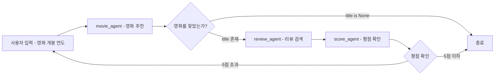

# PydanticAI

(+) **Python스러운 에이전트 구현** — `@agent.tool`, `@agent.instructions` 데코레이터 기반       
(+) **강력한 타입 체크** — `Agent[DepsT, OutputT]` 제네릭으로 컴파일 타임 검증 ([2장](#2-의존성과-출력-관리))       
(+) **적당한 추상화 수준** — `Agent` 하나로 LLM/도구/상태/출력이 완결 ([1장](#1-기본))     
(+) **구현이 직관적** — 데코레이터와 타입 힌트만으로 흐름이 코드에 드러남 ([5장](#5-그래프))        
(-) **작은 커뮤니티** — 레퍼런스 문서/참고 자료 부족     
(-) **built-in 컴포넌트 부족** — RAG, 히스토리 영속화는 직접 구현 필요 ([6장](#6-rag))       

## 목차

- [1. 기본](#1-기본)
  - [1-1. 채팅](#1-1-채팅)
  - [1-2. 싱글 턴(Single-turn)](#1-2-싱글-턴single-turn)
  - [1-3. 멀티 턴(Multi-turn)](#1-3-멀티-턴multi-turn)
- [2. 의존성과 출력 관리](#2-의존성과-출력-관리)
  - [2-1. 상태와 출력](#2-1-상태와-출력)
  - [2-2. JSON 출력](#2-2-json-출력)
  - [2-3. Pydantic Validation 체크](#2-3-pydantic-validation-체크)
- [3. Tool을 이용한 Agent 구현](#3-tool을-이용한-agent-구현)
  - [3-1. Tool 등록](#3-1-tool-등록)
  - [3-2. Capability](#3-2-capability)
- [4. 워크플로우 (멀티에이전트)](#4-워크플로우-멀티에이전트)
  - [4-1. 위임 (Delegation)](#4-1-위임-delegation)
  - [4-2. 프로그래밍적인 핸드오프 (Handoff)](#4-2-프로그래밍적인-핸드오프-handoff)
- [5. 그래프](#5-그래프)
  - [5-1. 복잡한 워크플로우의 문제점](#5-1-복잡한-워크플로우의-문제점)
  - [5-2. Pydantic Graph로 해결](#5-2-pydantic-graph로-해결)
- [6. RAG](#6-rag)

---

## 1. 기본

Agent는 LLM과 상호작용하기 위해 사용하는 PydanticAI의 기본 인터페이스.<br>
LLM과의 상호작용을 중심으로 모델링하며, Agent 인터페이스를 기반으로 구현한다.

### 1-1. 채팅

[01-basic/01-chat.py](../../pydantic/01-basic/01-chat.py)

**Agent 생성**

Agent 생성 시 사용할 모델, 시스템 지시(instructions), 모델 설정(model_settings)을 지정한다.

```python
agent = Agent(
    "openai:gpt-4o",
    instructions="도시 정보를 정확하게 알려줘.",
    model_settings={
        'temperature': 0.3,
        'max_tokens': 500,
    },
)
```

**동적 instruction 추가**

`@agent.instructions` 데코레이터를 사용하면 런타임에 동적으로 instruction을 추가할 수 있다.<br>
정적 `instructions`와 동적 `@agent.instructions`는 합쳐져서 LLM에 전달된다.

```python
@agent.instructions
def length():
    return "결과는 500글자 이내로 작성해줘."
```

메시지 우선순위: 정적 instructions → @agent.instructions(동적) → user_prompt

**실행**

`agent.run()`으로 에이전트를 실행하고, `response.output`에서 결과를 가져온다.

```python
response = await agent.run(user_prompt="서울에 대해 알려줘")
print(response.output)
```

**전체 코드**

```python
import asyncio

from dotenv import load_dotenv
from pydantic_ai import Agent

load_dotenv()

agent = Agent(
    "openai:gpt-4o",
    instructions="도시 정보를 정확하게 알려줘.",
    model_settings={
        'temperature': 0.3,
        'max_tokens': 500,
    },
)

@agent.instructions
def length():
    return "결과는 500글자 이내로 작성해줘."

async def main():
    response = await agent.run(user_prompt="서울에 대해 알려줘")
    print(response.output)

if __name__ == "__main__":
    asyncio.run(main())
```

### 1-2. 싱글 턴(Single-turn)

[01-basic/02-single-turn.py](../../pydantic/01-basic/02-single-turn.py)

히스토리를 전달하지 않으면 각 호출이 독립적으로 실행되어 이전 맥락을 알 수 없다.<br>
아래 코드에서 두 번째 `agent.run()`은 첫 번째 호출의 결과("서울")를 모른다.

```python
response = await agent.run(user_prompt="서울에 대해 알려줘")

# 히스토리 미전달 → "방금 전 도시"가 뭔지 모름
response = await agent.run(user_prompt="방금 전 도시의 위도와 경도를 알려줘")
```

```
결과:
서울특별시는 대한민국의 수도이자 최대 도시로...

어떤 도시를 말씀하시는지 정보가 없습니다(이 대화에 도시명이 나오지 않았어요).
```

**전체 코드**

```python
import asyncio

from dotenv import load_dotenv
from pydantic_ai import Agent

load_dotenv()

agent = Agent(
    "openai:gpt-4o",
    instructions="도시 정보를 정확하게 알려줘. 결과는 500글자 이내로 작성해줘.",
    model_settings={
        'temperature': 0.3,
        'max_tokens': 500,
    },
)

async def main():
    response = await agent.run(user_prompt="서울에 대해 알려줘")
    print(response.output)

    response = await agent.run(user_prompt="방금 전 도시의 위도와 경도를 알려줘")
    print(response.output)

if __name__ == "__main__":
    asyncio.run(main())
```

### 1-3. 멀티 턴(Multi-turn)

[01-basic/03-multi-turn.py](../../pydantic/01-basic/03-multi-turn.py)

`response.all_messages()`로 이전 대화 내역을 가져와 `message_history`에 전달하면 맥락이 유지된다.<br>

```python
response = await agent.run(
    user_prompt="방금 전 도시의 위도와 경도를 알려줘",
    message_history=response.all_messages(),  # ← 이 한 줄 추가
)
```

```
결과:
서울특별시는 대한민국의 수도이자 최대 도시로...

서울(서울특별시) 중심부 기준 좌표는 위도 37.5665°N, 경도 126.9780°E 입니다.
```

**전체 코드**

```python
import asyncio

from dotenv import load_dotenv
from pydantic_ai import Agent

load_dotenv()

agent = Agent(
    "openai:gpt-4o",
    instructions="도시 정보를 정확하게 알려줘. 결과는 500글자 이내로 작성해줘.",
    model_settings={
        'temperature': 0.3,
        'max_tokens': 500,
    },
)

async def main():
    response = await agent.run(user_prompt="서울에 대해 알려줘")
    print(response.output)

    response = await agent.run(
        user_prompt="방금 전 도시의 위도와 경도를 알려줘",
        message_history=response.all_messages(),
    )
    print(response.output)

if __name__ == "__main__":
    asyncio.run(main())
```

---

## 2. 의존성과 출력 관리

### 2-1. 상태와 출력

[02-deps-and-output/01-deps-and-output.py](../../pydantic/02-deps-and-output/01-deps-and-output.py)

RunContext를 이용한 의존성 주입(DI)을 통해 Agent 실행 동안 공유할 상태나 외부 의존성(데이터베이스나 서비스 로직 등)을 관리한다.

**의존성(deps)과 출력(output) 정의**<br>
`deps_type`으로 에이전트에 주입할 상태 타입을 지정한다. <br>
일반적으로 상태는 `@dataclass`로 정의한다.<br>
`output_type`으로 응답을 Pydantic BaseModel로 구조화한다.<br>

```python
# Agent 실행 중에 공유할 상태
# Agent에 의존성 주입됨
@dataclass
class MyState:
    length: int

# Agent의 최종 출력 타입
class CityInfo(BaseModel):
    name: str
    country: str
    population: int

agent = Agent[MyState, CityInfo](   # [의존성타입, 출력타입]
    "openai:gpt-4o",
    instructions="도시 정보를 정확히 알려줘",
    deps_type=MyState,      # type: ignore
    output_type=CityInfo,   # type: ignore
)
```

**내부 동작**

`output_type=CityInfo`를 설정하면 PydanticAI가 내부적으로 결과 반환용 tool을 생성한다.

```
User → LLM → [output tool 호출 (CityInfo)] → 구조화된 응답
```

**RunContext로 deps 접근**

`@agent.instructions`에서 `RunContext[MyState]`를 받으면 `ctx.deps`로 주입된 상태에 타입 안전하게 접근할 수 있다.

```python
@agent.instructions
def length(ctx: RunContext[MyState]):
    return f"결과는 {ctx.deps.length} 글자 이내로 작성해줘."
```

**실행 시 deps 전달**

`agent.run()`에 `deps=MyState(200)`으로 상태를 주입한다.

```python
response = await agent.run(user_prompt="서울에 대해 알려줘", deps=MyState(200))
print(response.output)
# → name='서울(Seoul)' country='대한민국' population=9400000
```

**전체 코드**

```python
import asyncio
from dataclasses import dataclass

from dotenv import load_dotenv
from pydantic import BaseModel
from pydantic_ai import Agent, RunContext

load_dotenv()

# Agent 실행 중에 공유할 상태
# Agent에 의존성 주입됨
@dataclass
class MyState:
    length: int

# Agent의 최종 출력 타입
class CityInfo(BaseModel):
    name: str
    country: str
    population: int

agent = Agent[MyState, CityInfo](
    "openai:gpt-4o",
    instructions="도시 정보를 정확히 알려줘",
    deps_type=MyState,      # type: ignore
    output_type=CityInfo,   # type: ignore
)

@agent.instructions
def length(ctx: RunContext[MyState]):
    return f"결과는 {ctx.deps.length} 글자 이내로 작성해줘."

async def main():
    response = await agent.run(user_prompt="서울에 대해 알려줘", deps=MyState(200))
    print(response.output)

if __name__ == "__main__":
    asyncio.run(main())
```

### 2-2. JSON 출력

[02-deps-and-output/02-json-output.py](../../pydantic/02-deps-and-output/02-json-output.py)

2-1과 동일한 구조에서, 출력 부분만 `model_dump_json()`으로 JSON 직렬화한다.<br>

```python
print(response.output.model_dump_json(indent=2))
```

**JSON 결과**
```json
{
  "name": "서울",
  "country": "대한민국",
  "population": 9400000
}
```

**전체 코드**

```python
import asyncio
from dataclasses import dataclass

from dotenv import load_dotenv
from pydantic import BaseModel
from pydantic_ai import Agent, RunContext

load_dotenv()

@dataclass
class MyState:
    length: int

class CityInfo(BaseModel):
    name: str
    country: str
    population: int

agent = Agent[MyState, CityInfo](
    "openai:gpt-4o",
    instructions="도시 정보를 정확히 알려줘",
    deps_type=MyState,      # type: ignore
    output_type=CityInfo,   # type: ignore
)

@agent.instructions
def length(ctx: RunContext[MyState]):
    return f"결과는 {ctx.deps.length} 글자 이내로 작성해줘."

async def main():
    response = await agent.run(user_prompt="서울에 대해 알려줘", deps=MyState(200))
    print(response.output.model_dump_json(indent=2))

if __name__ == "__main__":
    asyncio.run(main())
```

### 2-3. Pydantic Validation 체크

[02-deps-and-output/03-validation.py](../../pydantic/02-deps-and-output/03-validation.py)

Pydantic의 `field_validator`로 입력(deps)과 출력(output_type) 모두에 검증 로직을 적용할 수 있다.

**입력 검증**

`MyState`를 `BaseModel`로 바꾸고 validator를 추가하면, 잘못된 값이 들어올 때 즉시 `ValidationError`가 발생한다.

```python
class MyState(BaseModel):
    length: int

    @field_validator('length')
    @classmethod
    def check_length(cls, v: int) -> int:
        if v >= 10000:
            raise ValueError("길이는 10000보다 작아야 한다.")
        return v
```

**출력 검증**

`CityInfo`에도 validator를 적용하면 LLM이 반환한 값이 조건에 맞지 않을 때 에러가 발생한다.
`retries` 옵션으로 검증 실패 시 LLM에게 재시도를 요청할 수 있다 (`retries=0`이면 즉시 에러).

```python
class CityInfo(BaseModel):
    name: str
    country: str
    population: int

    @field_validator('population')
    @classmethod
    def check_population(cls, v: int) -> int:
        if v >= 100000:
            raise ValueError("인구는 100000보다 작아야 한다.")
        return v

agent = Agent[MyState, CityInfo](
    ...
    retries=0,  # 검증 실패 시 재시도 없이 즉시 에러
)
```

예제는 `length=1000000`을 전달하므로 validator에 의해 즉시 `ValidationError`가 발생하는 **의도된 실패 예제**이다.

```python
response = await agent.run(
        user_prompt="서울에 대해 알려줘", 
        deps=MyState(length=1000000))
```

```
# 입력 검증 실패 시:
ValidationError: 길이는 10000보다 작아야 한다.

# 출력 검증 실패 시 (retries=0):
UnexpectedModelBehavior: Exceeded maximum retries (0) for output validation
```

**전체 코드**

```python
import asyncio

from dotenv import load_dotenv
from pydantic import BaseModel, field_validator
from pydantic_ai import Agent, RunContext

load_dotenv()

class MyState(BaseModel):
    length: int

    @field_validator('length')
    @classmethod
    def check_length(cls, v: int) -> int:
        if v >= 10000:
            raise ValueError("길이는 10000보다 작아야 한다.")
        return v

class CityInfo(BaseModel):
    name: str
    country: str
    population: int

    @field_validator('population')
    @classmethod
    def check_population(cls, v: int) -> int:
        if v >= 100000:
            raise ValueError("인구는 100000보다 작아야 한다.")
        return v

agent = Agent[MyState, CityInfo](
    "openai:gpt-4o",
    instructions="도시 정보를 정확히 알려줘",
    deps_type=MyState,      # type: ignore
    output_type=CityInfo,   # type: ignore
    retries=0,
)

@agent.instructions
def length(ctx: RunContext[MyState]):
    return f"결과는 {ctx.deps.length} 글자 이내로 작성해줘."

async def main():
    response = await agent.run(user_prompt="서울에 대해 알려줘", deps=MyState(length=1000000))
    print(response.output.model_dump_json(indent=2))

if __name__ == "__main__":
    asyncio.run(main())
```

**[참고] output_validator**

Pydantic 검증기로 처리하기 어려운 검증(예: DB 조회, API 호출)이 필요한 경우 `output_validator`를 사용한다.
`ModelRetry` 예외를 발생시키면 LLM이 오류 메시지를 보고 수정된 결과를 다시 생성한다.

```python
@agent.output_validator
async def validate_sql(ctx: RunContext[DatabaseConn], output: Output) -> Output:
    if isinstance(output, InvalidRequest):
        return output
    try:
        await ctx.deps.execute(f'EXPLAIN {output.sql_query}')
    except QueryError as e:
        raise ModelRetry(f'잘못된 쿼리: {e}')
    return output
```

---

## 3. Tool을 이용한 Agent 구현

에이전트에 도구(Tool)를 등록하면, LLM이 프롬프트를 분석하여 적절한 도구를 **자동으로 선택하고 호출**한다.
"생각 → 도구 호출 → 관찰 → 다시 생각" 루프가 바로 **ReAct 패턴**이며, PydanticAI는 `@agent.tool` 등록만으로 이 루프를 내부에서 자동 수행한다.

### 3-1. Tool 등록

[03-tool/01-tool.py](../../pydantic/03-tool/01-tool.py)

두 가지 방식으로 도구를 등록할 수 있다.

**@agent.tool**

RunContext를 첫 번째 인자로 받아 `ctx.deps`로 상태에 접근할 수 있다.<br>
도구 인자를 **Pydantic BaseModel(Search)** 로 구조화하면 `Field`의 `description`, `min_length` 등 검증도 추가할 수 있다.

```python
class Search(BaseModel):
    keyword: str = Field(description="검색어", min_length=2)
    location: str = Field(description="위치", min_length=1)

@agent.tool
def web_search(ctx: RunContext[MyState], search: Search) -> list[str]:
    """웹 검색을 해서 데이터를 가져옵니다."""
    return ["남산타워", "청와대", ctx.deps.building]
```

**@agent.tool_plain**

파라미터로 RunContext를 받지 않는 tool<br>
tool 실행을 위해 의존성이 필요 없는 경우 사용 

```python
@agent.tool_plain
def format_result(result: str) -> str:
    """결과를 포맷팅합니다."""
    return f"**-{result}-**"
```

** tool 사용 여부는 LLM이 판단**

LLM이 도구 사용 여부를 자율적으로 판단한다.<br> 
이미 알고 있는 정보(예: 서울의 유명 건물)로 답할 수 있다고 판단하면 도구를 건너뛸 수 있다:

LLM이 web_search tool을 사용하지 않기로 결정한 경우
```
유명 건물: 경복궁, N서울타워, 롯데월드타워, DDP, 국회의사당.
```

LLM이 web_search tool을 사용하기로 결정한 경우
```
유명 건물: 남산타워, 청와대, 글라스 하우스. (← deps.building이 포함됨)
```

**전체 코드**

```python
import asyncio

from dotenv import load_dotenv
from pydantic import BaseModel, Field
from pydantic_ai import Agent, RunContext

load_dotenv()

class MyState(BaseModel):
    length: int
    building: str

class Search(BaseModel):
    keyword: str = Field(description="검색어", min_length=2)
    location: str = Field(description="위치", min_length=1)

agent = Agent[MyState](
    "openai:gpt-4o",
    instructions="도시 정보를 정확히 알려줘",
    deps_type=MyState,  # type: ignore
)

@agent.instructions
def length(ctx: RunContext[MyState]):
    return f"결과는 {ctx.deps.length} 글자 이내로 작성해줘."

@agent.tool
def web_search(ctx: RunContext[MyState], search: Search) -> list[str]:
    """웹 검색을 해서 데이터를 가져옵니다."""
    return ["남산타워", "청와대", ctx.deps.building]

@agent.tool_plain
def format_result(result: str) -> str:
    """결과를 포맷팅합니다."""
    return f"**-{result}-**"

async def main():
    response = await agent.run(
        user_prompt="서울에 대해 알려줘. 서울에 있는 유명한 건물의 목록도 포함하고 결과를 포맷팅해줘.",
        deps=MyState(length=100, building="글라스 하우스"),
    )
    print(response.output)

if __name__ == "__main__":
    asyncio.run(main())
```

### 3-2. Capability

[03-tool/02-capability.py](../../pydantic/03-tool/02-capability.py)

Capability는 Tool, Hook, Instructions, Settings를 하나로 묶은 **재사용 가능한 단위**이다.
직접 도구를 정의하지 않아도 내장 Capability만으로 웹 검색/크롤링 등이 가능하다.

```python
agent = Agent(
    "anthropic:claude-opus-4-7",
    capabilities=[
        Thinking(),     # 사고 과정(chain-of-thought) 활성화
        WebSearch(),    # 웹 검색
        WebFetch(allowed_domains=['aladin.co.kr']),  # 특정 도메인 페이지 가져오기
    ],
)
```

**Capability의 동작 방식: 네이티브 우선, 자동 우회**

Capability는 LLM 자체의 기능(네이티브)을 우선 사용하고, 모델이 지원하지 않으면 자동으로 도구(@tool)로 우회한다.

```
WebSearch() 호출 시:
  Claude, OpenAI Responses API → LLM 서버에서 직접 검색 (네이티브, 빠름)
  기타 모델 → PydanticAI가 검색 도구를 자동 생성하여 등록 (우회)

WebFetch() 호출 시:
  Claude → Anthropic 서버에서 직접 웹 페이지를 가져옴 (서버 to 서버, 빠름)
  기타 모델 → PydanticAI가 httpx로 페이지를 가져오는 도구를 자동 생성 (우회)
```

개발자는 `WebSearch()`만 쓰면 되고, 모델별 분기는 PydanticAI가 알아서 처리한다.

**`openai:` vs `openai-responses:` 모델 ID**

OpenAI 모델은 두 가지 형식으로 지정할 수 있으며, 웹 검색 등의 네이티브 도구가 필요하면 `openai-responses:` 접두사를 사용해야 한다. 일반 채팅/구조화 출력만 필요하면 `openai:`로 충분하다.

| 모델 ID | API | 네이티브 WebSearch | 용도 |
|---|---|---|---|
| `openai:gpt-4o` | Chat Completions | X (PydanticAI가 도구로 우회) | 일반 채팅, 구조화 출력 |
| `openai-responses:gpt-4o` | Responses API | O | `WebSearch()` 등 네이티브 도구 활용 |

> 4~5장의 `review_agent`가 `openai-responses:gpt-4o`를 쓰는 이유도 `WebSearch()` 네이티브 호출을 위해서이다.

**전체 코드**

```python
import asyncio

from dotenv import load_dotenv
from pydantic_ai import Agent
from pydantic_ai.capabilities import Thinking, WebSearch, WebFetch

load_dotenv()

agent = Agent(
    "anthropic:claude-opus-4-7",
    instructions="도시 정보를 정확히 알려줘",
    capabilities=[
        Thinking(),
        WebSearch(),
        WebFetch(allowed_domains=['aladin.co.kr']),
    ],
)

async def main():
    response = await agent.run(
        user_prompt="오늘 삼성전자 주가를 조회해주고, aladin.co.kr에서 프로젝트 헤일메리 책 페이지를 찾아서 책 소개 부분을 요약해줘"
    )
    print(response.output)

if __name__ == "__main__":
    asyncio.run(main())
```

---

## 4. 워크플로우 (멀티에이전트)

여러 에이전트를 조합하여 복잡한 작업을 수행하는 두 가지 패턴이 있다.

### 4-1. 위임 (Delegation)

[04-workflow/01-delegation.py](../../pydantic/04-workflow/01-delegation.py)

에이전트가 **도구(@tool) 안에서 다른 에이전트를 호출**하는 패턴.<br>
상위 에이전트가 워크플로우를 주도하고, 하위 에이전트는 서브 작업으로 동작한다.

핵심은 `@movie_agent.tool` 안에서 `review_agent.run()`을 호출하고, `ctx.deps`로 상태를 공유하는 부분이다.

```python
@movie_agent.tool
async def review_movie(ctx: RunContext[ReviewCriteria], movie_title: str) -> str:
    """제목이 movie_title인 영화의 리뷰 찾기"""
    result = await review_agent.run(
        f"제목이 {movie_title}인 영화의 리뷰를 찾아줘. {ctx.deps.criteria} 조건에 해당하는 리뷰를 선택해줘.",
        deps=ctx.deps,  # 상위 에이전트의 deps를 하위에 전달
    )
    return result.output
```

**전체 코드**

```python
import asyncio
from dataclasses import dataclass

from dotenv import load_dotenv
from pydantic_ai import Agent, RunContext
from pydantic_ai.capabilities import WebSearch

load_dotenv()

@dataclass
class ReviewCriteria:
    criteria: str

movie_agent = Agent[ReviewCriteria](
    'openai:gpt-4o',
    deps_type=ReviewCriteria,   # type: ignore
    instructions="영화 전문가들을 위한 영화를 선택해줘",
)

review_agent = Agent[ReviewCriteria](
    "openai-responses:gpt-4o",
    deps_type=ReviewCriteria,   # type: ignore
    capabilities=[WebSearch()],
)

@movie_agent.tool
async def review_movie(ctx: RunContext[ReviewCriteria], movie_title: str) -> str:
    """제목이 movie_title인 영화의 리뷰 찾기"""
    result = await review_agent.run(
        f"제목이 {movie_title}인 영화의 리뷰를 찾아줘. {ctx.deps.criteria} 조건에 해당하는 리뷰를 선택해줘.",
        deps=ctx.deps,
    )
    return result.output

async def main():
    result = await movie_agent.run(
        "2020년에 나온 한국 영화를 추천해 주고 그 영화의 리뷰를 알려줘",
        deps=ReviewCriteria(criteria="가장 최신에 작성된"),
    )
    print(result.output)

if __name__ == "__main__":
    asyncio.run(main())
```

### 4-2. 프로그래밍적인 핸드오프 (Handoff)

[04-workflow/02-handoff.py](../../pydantic/04-workflow/02-handoff.py)

여러 에이전트가 연속으로 호출되며, **애플리케이션 코드(main)가 다음에 호출할 에이전트를 결정**하는 방식.<br>
에이전트들은 상태를 공유할 필요가 없고, 서로의 존재를 모른다.

위임 패턴과 달리 Agent에서 흐름을 제어한다:

```python
async def main():
    movie = await find_movie()           # 1단계: 영화 추천
    if movie.title is not None:
        review = await review_movie(movie.title)  # 2단계: 리뷰 검색
        print(review)
```

**전체 코드**

```python
import asyncio
from dataclasses import dataclass

from dotenv import load_dotenv
from pydantic import Field, BaseModel
from pydantic_ai import Agent
from pydantic_ai.capabilities import WebSearch

load_dotenv()

@dataclass
class ReviewCriteria:
    criteria: str

class MovieOutput(BaseModel):
    title: str | None = Field(description="영화 제목", default=None, max_length=100)

movie_agent = Agent[None, MovieOutput](
    'openai:gpt-4o',
    output_type=MovieOutput,    # type: ignore
    instructions="영화 전문가들을 위한 영화를 선택해줘. 적절한 영화가 없으면 title을 null로 반환해줘",
)

review_agent = Agent[ReviewCriteria](
    "openai-responses:gpt-4o",
    deps_type=ReviewCriteria,   # type: ignore
    capabilities=[WebSearch()],
)

async def find_movie() -> MovieOutput:
    result = await movie_agent.run("2020년에 나온 한국 영화를 추천해 줘")
    return result.output

async def review_movie(movie_title: str) -> str:
    result = await review_agent.run(
        f"제목이 {movie_title}인 영화의 리뷰를 찾아줘",
        deps=ReviewCriteria(criteria="가장 최신에 작성된"),
    )
    return result.output

async def main():
    movie = await find_movie()
    if movie.title is not None:
        review = await review_movie(movie.title)
        print(review)

if __name__ == "__main__":
    asyncio.run(main())
```

**위임 vs 핸드오프 비교**

| | 위임 (Delegation) | 핸드오프 (Handoff) |
|---|---|---|
| 제어 주체 | 상위 에이전트가 도구로 하위 에이전트 호출 | main()에서 순차 호출 |
| 상태 공유 | ctx.deps로 공유 | 불필요 (결과만 전달) |
| 에이전트 결합도 | 높음 (서로를 알고 있음) | 낮음 (서로의 존재를 모름) |

---

## 5. 그래프

워크플로우가 복잡해지면 (분기, 반복, 조건부 종료 등), 순수 Python 코드로 관리하기 어려워진다.<br>
이런 경우 **pydantic-graph**를 사용하면 각 단계를 노드로 분리하고, 흐름을 타입 힌트로 선언할 수 있다.

### 5-1. 복잡한 워크플로우의 문제점

[05-graph/01-workflow.py](../../pydantic/05-graph/01-workflow.py)

아래는 04-workflow의 예제에 조건(`if/break`) 반복(`while True`)을 추가한 예제로 다음과 같은 흐름을 구현하고 있다.<br>
```python
    while True:
        year = Prompt.ask("...")                    # ← 반복

        movie = await find_movie(year)
        if movie.title is None:                     # ← 분기 1
            print("영화를 찾지 못해 종료합니다.")          # 영화를 찾지 못하면 종료
            break
        print(f"영화 제목: {movie.title}")

        review = await review_movie(movie.title)
        print(review)

        score = await review_score(movie.title)
        if score.value <= 5:                        # ← 분기 2
            print("평점이 5점 이하인 경우 종료합니다.")     # 평점이 5점 이하면 종료
            break
```

이 코드의 문제점은 다음과 같다: 
- 분기/반복 로직이 main()의 if/while에 흩어져 있어 흐름 파악이 어려움
- 단계 추가/변경 시 main() 전체를 수정해야 함
- 상태 영속화(일시 정지/재개)가 불가능
- 워크플로우 구조를 시각화할 방법이 없음



**전체 코드**

```python
import asyncio

from dotenv import load_dotenv
from pydantic import Field, BaseModel
from pydantic_ai import Agent
from pydantic_ai.capabilities import WebSearch
from rich.prompt import Prompt

load_dotenv()

class MovieOutput(BaseModel):
    title: str | None = Field(description="영화 제목", default=None, max_length=100)

class ReviewScore(BaseModel):
    value: int = Field(description="리뷰 점수", ge=1, le=10)

movie_agent = Agent[None, MovieOutput](
    'openai:gpt-4o',
    output_type=MovieOutput,  # type: ignore
    instructions="영화 전문가들을 위한 영화를 선택해줘. 적절한 영화가 없으면 title을 null로 반환해줘",
)

review_agent = Agent(
    "openai-responses:gpt-4o",
    capabilities=[WebSearch()],
)

score_agent = Agent[None, ReviewScore](
    'openai:gpt-4o',
    output_type=ReviewScore,
    instructions="리뷰 점수는 1점에서 10점 사이 정수값으로 변환해서 줘",
)

async def find_movie(year: str) -> MovieOutput:
    result = await movie_agent.run(f"{year}년에 개봉한 영화를 추천해 줘")
    return result.output

async def review_movie(movie_title: str) -> str:
    result = await review_agent.run(f"제목이 {movie_title}인 영화의 리뷰를 1개만 찾아줘")
    return result.output

async def review_score(movie_title: str) -> ReviewScore:
    result = await score_agent.run(f"제목이 {movie_title}인 영화의 리뷰 점수를 찾아줘")
    return result.output

async def main():
    while True:
        year = Prompt.ask("영화 개봉 연도를 입력하세요")

        movie = await find_movie(year)
        if movie.title is None:
            print("영화를 찾지 못해 종료합니다.")
            break
        print(f"영화 제목: {movie.title}")

        review = await review_movie(movie.title)
        print(review)

        score = await review_score(movie.title)
        if score.value <= 5:
            print("평점이 5점 이하인 경우 종료합니다.")
            break
        print(f"리뷰 점수: {score.value}")

if __name__ == "__main__":
    asyncio.run(main())
```

### 5-2. Pydantic Graph로 해결

[05-graph/02-graph.py](../../pydantic/05-graph/02-graph.py)

pydantic-graph를 사용하면 위 문제가 해결된다:
- 각 단계를 **독립된 노드 클래스**로 분리
- **State**를 이용해서 노드 간 구조화된 데이터 공유
- 분기/반복이 **리턴 타입**으로 선언되어 구조가 코드에 드러남
- `graph.mermaid_code()`로 워크플로우를 **자동 시각화**

**구현 방식 요약**

pydantic-graph는 네 가지 요소로 그래프를 구성한다:

| 요소 | 구현 방식 | 설명 |
|---|---|---|
| **상태** | `@dataclass` | 노드 간 공유되는 변경 가능한 데이터 |
| **노드** | `@dataclass` + `BaseNode` 상속 | `run()` 메서드를 가진 클래스 |
| **엣지 + 분기** | `run()`의 **리턴 타입** + 내부 로직 | Union 타입으로 다음 노드 선언(`-> A \| B \| End`), 내부 if로 분기 |
| **그래프 조립** | `Graph(nodes=(...))` | 노드 클래스만 등록하면 완성 |

pydantic-graph는 **Python 타입 시스템**으로 그래프 구조를 표현한다.<br>
node는 클래스로 구현<br>
엣지는 노드(node)가 반환하는 타입을 기반으로 연결

**1. 상태 = dataclass로 정의**

모든 노드가 `ctx.state`를 통해 하나의 상태 객체를 공유한다.<br>
`dataclass`를 이용해서 상태 클래스를 정의하며, 필드를 직접 수정 가능하다.<br>
상태는 이어 살펴볼 run 메서드의 파라미터로 전달된다. 

```python
@dataclass
class WorkflowState:
    year: str = ""
    movie_title: str = ""
    review: str = ""
    score: int = 0
```

**2. 노드 = dataclass 클래스 + run() 메서드**

각 노드는 `BaseNode`를 상속한 `@dataclass` 클래스이다.<br>
`run()` 메서드 안에서 `ctx.state`로 상태를 읽고 수정한다.

```python
@dataclass
class FindMovieNode(BaseNode[WorkflowState, None, str]):
    async def run(self, ctx: GraphRunContext[WorkflowState]) -> ReviewMovieNode | End[str]:
        result = await movie_agent.run(
            f"{ctx.state.year}년에 개봉한 영화를 추천해 줘")

        # ctx.state를 직접 수정
        ctx.state.movie_title = result.output.title
        return ReviewMovieNode()
```

**3. 엣지 = 리턴 타입, 분기 = run() 안의 로직**

`run()`의 리턴 타입이 곧 다음 노드(엣지)이다.<br>
그래프를 종료시키고 싶으면 End를 리턴하면 된다.

여러 엣지를 분기하고 싶으면 Union 타입(`|`)으로 표현한다.<br>
**`run()` 안에서 직접 조근을 분기시키고 원하는 노드 타입을 반환**하면 된다.

```python
# 리턴 타입 선언이 곧 엣지: ReviewMovieNode 또는 End[str]
async def run(self, ctx: GraphRunContext[WorkflowState]) -> ReviewMovieNode | End[str]:
    # 분기는 run() 안의 로직으로 처리
    if result.output.title is None:
        return End("영화를 찾지 못해 종료합니다.")  # → 종료
    return ReviewMovieNode()                          # → 다음 노드
```

**4. 그래프 조립 = 노드 클래스를 나열하면 끝**

엣지는 이미 리턴 타입으로 정의되어 있으므로, 그래프에 포함시킬 노드만 등록하면 그래프가 완성된다.

```python
# async 함수 내부에서 실행
async def main():
    # 그래프 노드 구성
    movie_graph = Graph(nodes=(InputNode, FindMovieNode, ReviewMovieNode, CheckScoreNode))

    # 상태 생성
    state = WorkflowState()

    # Input 노드에서 시작하도록 그래프 실행
    result = await movie_graph.run(InputNode(), state=state)
```


**전체 코드**

```python
from __future__ import annotations

import asyncio
from dataclasses import dataclass

from dotenv import load_dotenv
from pydantic import Field, BaseModel
from pydantic_ai import Agent
from pydantic_ai.capabilities import WebSearch
from pydantic_graph import BaseNode, End, Graph, GraphRunContext
from rich.prompt import Prompt

load_dotenv()

@dataclass
class WorkflowState:
    year: str = ""
    movie_title: str = ""
    review: str = ""
    score: int = 0

class MovieOutput(BaseModel):
    title: str | None = Field(description="영화 제목", default=None, max_length=100)

class ReviewScore(BaseModel):
    value: int = Field(description="리뷰 점수", ge=1, le=10)

movie_agent = Agent[None, MovieOutput](
    'openai:gpt-4o',
    output_type=MovieOutput,    # type: ignore
    instructions="영화 전문가들을 위한 영화를 선택해줘. 적절한 영화가 없으면 title을 null로 반환해줘",
)

review_agent = Agent(
    "openai-responses:gpt-4o",
    capabilities=[WebSearch()],
)

score_agent = Agent[None, ReviewScore](
    'openai:gpt-4o',
    output_type=ReviewScore,
    instructions="리뷰 점수는 1점에서 10점 사이 정수값으로 변환해서 줘",
)

@dataclass
class InputNode(BaseNode[WorkflowState, None, str]):
    """사용자로부터 영화 개봉 연도를 입력받는 노드"""
    async def run(self, ctx: GraphRunContext[WorkflowState]) -> FindMovieNode:
        ctx.state.year = Prompt.ask("영화 개봉 연도를 입력하세요")
        return FindMovieNode()

@dataclass
class FindMovieNode(BaseNode[WorkflowState, None, str]):
    """movie_agent를 이용해 영화를 추천받는 노드"""
    async def run(self, ctx: GraphRunContext[WorkflowState]) -> ReviewMovieNode | End[str]:
        result = await movie_agent.run(
            f"{ctx.state.year}년에 개봉한 영화를 추천해 줘")

        if result.output.title is None:
            return End("영화를 찾지 못해 종료합니다.")

        ctx.state.movie_title = result.output.title

        print(f"영화 제목: {ctx.state.movie_title}")
        return ReviewMovieNode()

@dataclass
class ReviewMovieNode(BaseNode[WorkflowState, None, str]):
    """review_agent를 이용해 영화 리뷰를 검색하는 노드"""
    async def run(self, ctx: GraphRunContext[WorkflowState]) -> CheckScoreNode:
        result = await review_agent.run(
            f"제목이 {ctx.state.movie_title}인 영화의 리뷰를 1개만 찾아줘")

        ctx.state.review = result.output

        print(ctx.state.review)
        return CheckScoreNode()

@dataclass
class CheckScoreNode(BaseNode[WorkflowState, None, str]):
    """score_agent를 이용해 평점을 확인하고, 5점 이하면 종료 / 초과면 반복"""
    async def run(self, ctx: GraphRunContext[WorkflowState]) -> InputNode | End[str]:
        result = await score_agent.run(
            f"제목이 {ctx.state.movie_title}인 영화의 리뷰 점수를 찾아줘")

        ctx.state.score = result.output.value
        if ctx.state.score <= 5:
            return End("평점이 5점 이하인 경우 종료합니다.")
        print(f"리뷰 점수: {ctx.state.score}")

        return InputNode()

async def main():
    movie_graph = Graph(
        nodes=(InputNode, FindMovieNode, ReviewMovieNode, CheckScoreNode)
    )

    print(movie_graph.mermaid_code())
    print("---")

    state = WorkflowState()
    result = await movie_graph.run(InputNode(), state=state)
    print(result.output)

if __name__ == "__main__":
    asyncio.run(main())
```

---

## 6. RAG

[06-rag/01-rag.py](../../pydantic/06-rag/01-rag.py)

PydanticAI에는 벡터 DB, 임베딩, 문서 로더 등 RAG 관련 기능이 내장되어 있지 않아
모든 파이프라인을 직접 구현해야 한다.

**PDF → 청킹 → 임베딩 → 벡터 DB**

각 단계를 직접 구현해야 한다:

```python
# 1. PDF 텍스트 추출 — PyMuPDF 직접 사용
raw_text = extract_text_from_pdf(PDF_PATH)

# 2. 텍스트 청킹 — 직접 구현
chunks = split_text(raw_text, chunk_size=500, overlap=100)

# 3. 임베딩 — OpenAI API 직접 호출
embeddings = embed_texts(chunks)

# 4. 벡터 DB 저장 — ChromaDB 직접 관리
collection.add(documents=chunks, embeddings=embeddings, ids=[...])
```

**검색 도구 등록**

검색 로직도 직접 구현하고 `@agent.tool`로 등록해야 한다.
`ctx.deps.collection`으로 deps에서 벡터 DB에 접근한다:

```python
@agent.tool
def retrieve(ctx: RunContext[RagDeps], query: str) -> str:
    """질문과 관련된 문서를 검색합니다."""
    query_embedding = embed_texts([query])
    results = ctx.deps.collection.query(
        query_embeddings=query_embedding,
        n_results=3,
    )
    return "\n\n".join(results["documents"][0])
```

**전체 코드**

```python
import asyncio
import os
from dataclasses import dataclass

import fitz  # PyMuPDF
import chromadb
from dotenv import load_dotenv
from openai import OpenAI
from pydantic_ai import Agent, RunContext

load_dotenv()

PDF_PATH = os.path.join(os.path.dirname(__file__), "../../data/jeju_guide.pdf")
CHROMA_PATH = os.path.join(os.path.dirname(__file__), "./chroma_db")

def extract_text_from_pdf(path: str) -> str:
    """PyMuPDF로 PDF에서 텍스트 추출"""
    doc = fitz.open(path)
    text = ""
    for page in doc:
        text += page.get_text()
    doc.close()
    return text

def split_text(text: str, chunk_size: int = 500, overlap: int = 100) -> list[str]:
    """텍스트를 chunk_size 단위로 분할 (overlap 포함)"""
    chunks = []
    start = 0
    while start < len(text):
        end = start + chunk_size
        chunks.append(text[start:end])
        start = end - overlap
    return [c.strip() for c in chunks if c.strip()]

openai_client = OpenAI()

def embed_texts(texts: list[str]) -> list[list[float]]:
    """OpenAI API로 임베딩을 직접 호출"""
    response = openai_client.embeddings.create(
        model="text-embedding-3-small",
        input=texts,
    )
    return [item.embedding for item in response.data]

print("PDF 텍스트 추출 중...")
raw_text = extract_text_from_pdf(PDF_PATH)
chunks = split_text(raw_text)
print(f"청킹 완료: {len(chunks)}개 청크")

chroma_client = chromadb.PersistentClient(path=CHROMA_PATH)
collection = chroma_client.get_or_create_collection(name="jeju_guide")

if collection.count() == 0:
    print("임베딩 중...")
    embeddings = embed_texts(chunks)
    collection.add(
        documents=chunks,
        embeddings=embeddings,
        ids=[f"chunk_{i}" for i in range(len(chunks))],
    )
    print(f"임베딩 완료: {len(chunks)}건 저장")
else:
    print(f"기존 데이터 사용: {collection.count()}건")

@dataclass
class RagDeps:
    collection: chromadb.Collection

agent = Agent[RagDeps](
    "openai:gpt-4o",
    instructions="검색된 문서를 기반으로 정확하게 답변해줘. 문서에 없는 내용은 추측하지 마.",
    deps_type=RagDeps,  # type: ignore
)

@agent.tool
def retrieve(ctx: RunContext[RagDeps], query: str) -> str:
    """질문과 관련된 문서를 검색합니다.

    Args:
        query: 검색할 질문
    """
    query_embedding = embed_texts([query])
    results = ctx.deps.collection.query(
        query_embeddings=query_embedding,
        n_results=3,
    )
    return "\n\n".join(results["documents"][0])

async def main():
    deps = RagDeps(collection=collection)

    response = await agent.run(
        user_prompt="제주도의 해녀 문화에 대해 알려줘",
        deps=deps,
    )
    print(response.output)

if __name__ == "__main__":
    asyncio.run(main())
```

**LangChain과 비교** ([langchain/06-rag/01-rag.py](../../langchain/06-rag/01-rag.py))

LangChain은 PDF 로더/청커/임베딩/벡터 DB/검색기가 모두 내장 컴포넌트로 제공되어, 같은 RAG를 **수 줄 수준으로 조립**할 수 있다.

```python
# LangChain — 각 단계가 한 줄
docs = PyMuPDFLoader(PDF_PATH).load()
chunks = RecursiveCharacterTextSplitter(chunk_size=500, chunk_overlap=100).split_documents(docs)
vectorstore = Chroma.from_documents(chunks, OpenAIEmbeddings(...), persist_directory=CHROMA_PATH)
retriever = vectorstore.as_retriever(search_kwargs={"k": 3})
```

검색기 이후의 **프롬프트 주입 → LLM 호출 → 출력 파싱**까지 LCEL 파이프(`|`)로 선언적으로 연결된다. PydanticAI처럼 `@agent.tool`에 검색 함수를 등록하고 에이전트 루프에 맡길 필요 없이, 체인 자체가 RAG 흐름을 표현한다.

```python
prompt = ChatPromptTemplate.from_messages([
    ("system", "검색된 문서를 기반으로 정확하게 답변해줘. 문서에 없는 내용은 추측하지 마.\n\n{context}"),
    ("human", "{question}"),
])

chain = (
    {"context": retriever | (lambda docs: "\n\n".join(d.page_content for d in docs)),
     "question": RunnablePassthrough()}
    | prompt
    | init_chat_model("gpt-4o", model_provider="openai")
    | StrOutputParser()
)
```

| 단계 | PydanticAI | LangChain |
|---|---|---|
| PDF 로드 | `fitz.open()` + 루프 직접 구현 | `PyMuPDFLoader(path).load()` |
| 청킹 | `split_text()` 직접 구현 | `RecursiveCharacterTextSplitter()` |
| 임베딩 | `openai_client.embeddings.create()` 직접 호출 | `OpenAIEmbeddings()` |
| 벡터 DB | `chromadb.PersistentClient()` 직접 관리 | `Chroma.from_documents()` |
| 검색 | `collection.query()` + `@agent.tool` 등록 | `retriever` 파이프 연결 |
| **총 라인 수** | **~128줄** | **~63줄** |
| **DB 교체** | 전부 다시 구현 | `Chroma` → `FAISS` 한 줄 교체 |

RAG처럼 표준화된 파이프라인에서는 **LangChain의 풍부한 내장 컴포넌트가 명확한 장점**이다. PydanticAI는 에이전트 코어에 집중하는 대신 이런 인프라성 기능은 직접 구현하거나 외부 라이브러리에 의존해야 한다.
